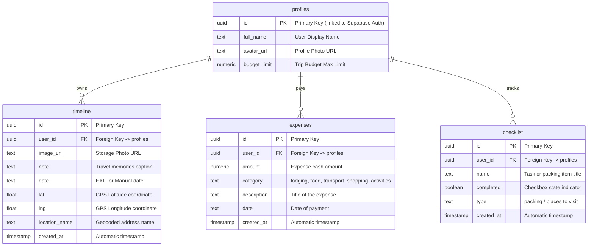

# MASA (מסע) 🧭 — אתר דאשבורד אינטראקטיבי לניהול ותיעוד טיולים

**קישור ישיר לפרויקט הפרוס ב-Vercel:** [https://masa-sage.vercel.app/](https://masa-sage.vercel.app/)

---

## 📖 סקירה כללית (Project Overview)
**MASA** היא פלטפורמת דאשבורד אינטראקטיבית ויוקרתית לניהול ותיעוד טיולים בזמן אמת. האפליקציה מרכזת תחת קורת גג אחת כלי מעקב פיננסיים (תקציב והוצאות), כלים גאוגרפיים (מפת Leaflet עם סיכות המבוססות על מטא-דאטה של תמונות), יומן מסע כרונולוגי ורשימות הכנה ותכנון מקיפות למטיילים.

---

## 📌 הבעיה והפתרון (Problem & Solution)

### הבעיה
תהליך תכנון ותיעוד טיולים כיום הוא מפוזר ומסורבל. מטיילים נאלצים להשתמש במספר רב של אפליקציות שונות שאינן מתקשרות ביניהן:
* גיליונות אקסל (Google Sheets) למעקב אחר תקציב והוצאות.
* קבוצות וואטסאפ (WhatsApp) פנימיות לשמירת רשימות ציוד, קישורים והמלצות.
* גלריית התמונות של המכשיר לצילומים וזיכרונות.
* פתקאות (Notes) לניהול משימות ולוחות זמנים.

הפיזור הזה גורם לאובדן מידע, חריגות מהתקציב המתוכנן, וחוסר יכולת לחבר את התמונות למיקומן הפיזי על המפה בצורה ויזואלית ופשוטה.

### הפתרון
**MASA** מאחדת את כל הכלים הללו לממשק אחד, אינטראקטיבי ויוקרתי (Glassmorphism), המציע סינכרון מושלם:
1. **מפת חוויות דינמית:** העלאת תמונות שולפת אוטומטית את קואורדינטות ה-GPS ותאריך הצילום (EXIF) ומציבה סיכה ייחודית עם תמונת המשתמש על גבי הגלובוס.
2. **בחירה ידנית מתקדמת:** במידה והתמונה ללא GPS, המערכת מאפשרת למקם אותה ידנית בעזרת סיכה נגררת (Draggable Pin) ותיבת חיפוש מיקומים גלובלית, תוך פיענוח הכתובת בזמן אמת בהתאם לרמת הזום במפה.
3. **יומן מסע כרונולוגי:** פיד זיכרונות מעוצב המחובר למיקומים במפה ומציג את התמונות, התאריכים והחוויות של המטייל.
4. **ניהול תקציב מבוקר:** מעקב אחר הוצאות בשקלים (₪) עם פילוח לקטגוריות (לינה, אוכל, תחבורה, קניות, אטרקציות) ותרשים דונאט אינטראקטיבי המציע התרעות על חריגה מהתקציב.
5. **רשימות תכנון (Checklist):** מנגנון מעקב מפוצל לרשימות ציוד לאריזה (Packing) ויעדים לביקור (Places to visit) עם מד התקדמות אחוזי (Progress Bar).

---

## 👥 קהל היעד (Target Audience)
* **מטיילים עצמאיים ותרמילאים (Backpackers):** הזקוקים לשלוט בתקציב הדוק ולתכנן רשימות ציוד ומקומות לביקור בצורה מסודרת.
* **בלוגרים וחובבי צילום גיאוגרפי:** המעוניינים לתעד ולמפות את המסלול שלהם בעולם בצורה ויזואלית על גבי הגלובוס.
* **משפחות וקבוצות חברים בטיול:** הזקוקים לריכוז מנהלי של ההוצאות ורשימות ההכנה במקום אחד יציב.

---

## 🏆 מתחרים ובידול (Competitors & Differentiation)

| תכונה / פרמטר | MASA 🧭 | אקסל (Google Sheets) 📊 | קבוצת וואטסאפ (WhatsApp) 💬 | גלריית תמונות במכשיר 📸 |
| :--- | :---: | :---: | :---: | :---: |
| **ניהול תקציב והוצאות** | **כן** (כולל תרשימים והתרעות) | כן (ידני ומורכב) | לא | לא |
| **מיפוי גיאוגרפי אוטומטי** | **כן** (על בסיס EXIF בתמונה) | לא | לא | חלקי (ללא קשר לתקציב/יומן) |
| **רשימות ציוד ומשימות** | **כן** (כולל מד התקדמות) | כן (טקסט פשוט) | חלקי (הולך לאיבוד בצ'אט) | לא |
| **ממשק משתמש וריספונסיביות** | **כן** (ממשק Glassmorphism RTL) | לא (מסורבל בנייד) | כן | כן |
| **איחוד תחת ממשק אחד** | **כן** (הכל מסונכרן) | לא | לא | לא |

**הבידול של MASA:** הבידול המרכזי הוא ה**סינכרון הוויזואלי החכם**. העלאת תמונה בודדת מייצרת בו זמנית סיכת מפה, רשומה כרונולוגית ביומן המסע, ומזהה את שם המיקום הגיאוגרפי המדויק. החיבור של מנגנון ניהול התקציב יחד עם תיעוד החוויות והכנת הציוד בממשק כהה, מהיר ומעוצב ללא placeholders, מעניק למטייל חוויית שליטה וזיכרון שאינה קיימת באף כלי בנפרד.

---

## 📐 דגם נתונים וקשרי גומלין (ERD Diagram)

להלן מבנה בסיס הנתונים של MASA המנוהל ב-Supabase ומאובטח באמצעות חוקי RLS (Row Level Security) המבודדים את המידע של כל מטייל:



---

## ⚙️ שירותים חיצוניים ואינטגרציות (External Services)

| שם השירות | סוג האינטגרציה | למה משמש במערכת? | אבטחה וניהול מפתחות |
| :--- | :--- | :--- | :--- |
| **Supabase Database** | PostgreSQL DB | שמירת כל נתוני המשתמשים, התקציבים, הרשימות ויומני המסלול. | מאובטח תחת חוקי RLS המונעים גישה לנתונים של משתמשים אחרים. |
| **Supabase Auth (Google)** | OAuth 2.0 | התחברות מאובטחת ומהירה לאתר דרך חשבון Google של המשתמש. | מנוהל בצד השרת של Supabase באמצעות מפתחות מוצפנים. |
| **Supabase Storage** | CDN Object Storage | אחסון קובצי התמונות שהועלו על ידי המטיילים בתיקיות ייעודיות. | תיקיית ה-Storage מוגנת בהרשאות קריאה/כתיבה למשתמשים מורשים בלבד. |
| **Nominatim API (OSM)** | REST API (JSON) | פיענוח קואורדינטות גיאוגרפיות (Lat/Lng) לשמות מיקומים וכתובות בעברית/אנגלית. | קריאות חופשיות מבוצעות ישירות מצד הלקוח עם הגדרת User-Agent תקינה בהתאם למדיניות השימוש. |
| **Leaflet & CartoDB** | Maps Rendering | הצגת מפת הגלובוס האינטראקטיבית, טעינת שכבות (לוויין, כהה, בהיר) וציור סיכות התמונה. | רכיב צד לקוח קל משקל ללא צורך במפתחות API חיצוניים בתשלום. |

---

## 🛠️ הוראות התקנה והרצה מקומית (Installation & Setup)

1. **שכפל את המאגר (Clone):**
   ```bash
   git clone https://github.com/guybd13-svg/MASA.git
   cd MASA
   ```
2. **התקן תלויות (Install Dependencies):**
   ```bash
   npm install
   ```
3. **הגדר משתני סביבה (Environment Variables):**
   צור קובץ בשם `.env.local` בתיקיית השורש של הפרויקט, והזן את פרטי הפרויקט של ה-Supabase שלך:
   ```env
   VITE_SUPABASE_URL=https://your-supabase-project-id.supabase.co
   VITE_SUPABASE_ANON_KEY=your-supabase-anon-key
   ```
4. **הרכב את בסיס הנתונים (Database Setup):**
   הרעש את קוד ה-SQL הבא בתוך ה-SQL Editor ב-Supabase שלך ליצירת הטבלאות וחוקי ה-RLS הנדרשים:
   * (קוד ה-SQL המלא וסקירות הנתונים מפורטים בתוך [masa_data_design_worksheet.md](file:///Users/guybendahan/.gemini/antigravity/scratch/travel-app/masa_data_design_worksheet.md)).
5. **הרעש את שרת הפיתוח (Run locally):**
   ```bash
   npm run dev
   ```
   האתר יהיה זמין בכתובת: `http://localhost:5173`.

---

## 🤖 פיתוח מבוסס AI ו-Vibe Coding (AI-Augmented Development)
פרויקט MASA פותח ועוצב באופן סימביוטי בשיתוף פעולה הדוק בין המשתמש לבין סוכן ה-AI **Antigravity** (מבית Google DeepMind). 

### שיטות עבודה וכלים שיושמו:
* **Vibe Coding:** ה-AI שימש כמפתח המוביל (Lead Developer) שביצע את שינויי הקוד וניהל את תהליכי הבנייה (build) והאימות של הפרויקט מקצה לקצה.
* **הפרדת סביבות ריצה (Terminal Sandbox):** כל פקודות הפיתוח המקומיות הורצו בתוך סביבה מבודדת (Standard Sandbox) לביצוע מהיר ובטוח, בעוד שפקודות גישה לרשת (כמו `git push`) הורצו בצורה מבוקרת באישור המשתמש.
* **סבבי בדיקות מהירים:** בוצעו איטרציות בדיקה מהירות באמצעות `tsc -b` ו-`vite build` כדי להבטיח קוד נקי מאי-תאימויות טיפוסים (TypeScript compilation errors) לפני ביצוע הדיפלומינט בשרתי Vercel.
