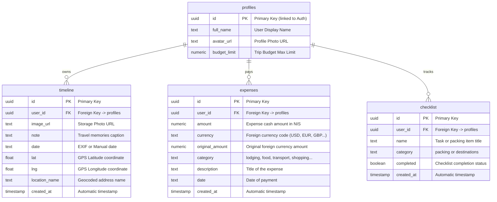

# MASA (מסע) 🧭 — אתר דאשבורד אינטראקטיבי לניהול ותיעוד טיולים

**קישור ישיר לפרויקט הפרוס ב-Vercel:** [https://masa-sage.vercel.app/](https://masa-sage.vercel.app/)

---

## 📖 סקירה כללית (Project Overview)
**MASA** היא פלטפורמת דאשבורד אינטראקטיבית ויוקרתית לניהול ותיעוד טיולים בזמן אמת. האפליקציה מרכזת תחת קורת גג אחת כלי מעקב פיננסיים (תקציב והוצאות), כלים גאוגרפיים (מפת Leaflet עם סיכות המבוססות על מטא-דאטה של תמונות או מיקום ידני), יומן מסע כרונולוגי ורשימות הכנה ותכנון למטיילים.

---

## 📌 הבעיה והפתרון (Problem & Solution)

### הבעיה (הכאב הקונקרטי)
תהליך תכנון ותיעוד טיולים כיום הוא מפוזר ומסורבל. מטיילים נאלצים להשתמש במספר רב של אפליקציות שונות שאינן מתקשרות ביניהן:
* גיליונות אקסל (Google Sheets) למעקב אחר תקציב והוצאות - מסורבל בנייד.
* קבוצות וואטסאפ (WhatsApp) פנימיות לשמירת רשימות ציוד והכנות - הולך לאיבוד בצ'אט.
* גלריית התמונות של המכשיר לצילומים וזיכרונות - ללא קשר ליומן או לתקציב.
* פתקאות (Notes) לניהול משימות ולוחות זמנים.

הפיזור הזה גורם לאובדן מידע, חריגות מהתקציב המתוכנן, וחוסר יכולת לחבר את התמונות למיקומן הפיזי על המפה בצורה ויזואלית ופשוטה.

### הפתרון
**MASA** מאחדת את כל הכלים הללו לממשק אחד, אינטראקטיבי ויוקרתי (Glassmorphism), המציע סינכרון מושלם:
1. **מפת חוויות דינמית באנגלית:** מפת CartoDB Voyager בינלאומית עם תגיות באנגלית. העלאת תמונות שולפת אוטומטית את קואורדינטות ה-GPS ותאריך הצילום (EXIF) ומציבה סיכה ייחודית עם תמונת המשתמש על גבי הגלובוס.
2. **בחירה ידנית מתקדמת:** במידה והתמונה ללא GPS, המערכת מאפשרת למקם אותה ידנית בעזרת סיכה נגררת (Draggable Pin) ותיבת חיפוש מיקומים גלובלית, תוך פיענוח הכתובת בזמן אמת.
3. **יומן מסע כרונולוגי:** פיד זיכרונות מעוצב המחובר למיקומים במפה ומציג את התמונות, התאריכים והחוויות של המטייל.
4. **ניהול תקציב והמרת מטבעות זרים:** מעקב אחר הוצאות במגוון מטבעות זרים ($, €, £, ¥ ועוד) עם המרה אוטומטית לשקלים (₪), פילוח לקטגוריות (לינה, אוכל, תחבורה, קניות, אטרקציות) ותרשים דונאט אינטראקטיבי המציע התרעות על חריגה מהתקציב.
5. **רשימות תכנון (Checklist):** מנגנון מעקב מפוצל לרשימות ציוד לאריזה (Packing) ויעדים לביקור (Places to visit) עם מד התקדמות אחוזי (Progress Bar).
6. **חוויית מובייל ייעודית (Mobile Responsive UX):** התאמה מושלמת למכשירים ניידים הכוללת בר ניווט תחתון (Bottom Navbar) נוח, הפרדת בקרי מפה ומניעת חפיפת לחצנים כדי להבטיח שימוש נוח ומקצועי מכל מקום בעולם.

---

## 👥 קהל היעד (Target Audience)
* **מטיילים עצמאיים ותרמילאים (Backpackers):** הזקוקים לשלוט בתקציב הדוק במטבעות זרים ולתכנן רשימות ציוד ומקומות לביקור בצורה מסודרת במהלך הטיול.
* **בלוגרים וחובבי צילום גיאוגרפי:** המעוניינים לתעד ולמפות את המסלול שלהם בעולם בצורה ויזואלית על גבי הגלובוס.
* **משפחות וקבוצות חברים בטיול:** הזקוקים לריכוז מנהלי של ההוצאות ורשימות ההכנה במקום אחד יציב.

---

## 🏆 מתחרים ובידול (Competitors & Differentiation)

| תכונה / פרמטר | MASA 🧭 | אקסל (Google Sheets) 📊 | קבוצת וואטסאפ (WhatsApp) 💬 | גלריית תמונות במכשיר 📸 |
| :--- | :---: | :---: | :---: | :---: |
| **ניהול תקציב והמרת מטבעות זרים** | **כן** (המרה אוטומטית לשקלים + תרשימים) | כן (חישוב מורכב וידני) | לא | לא |
| **מיפוי גיאוגרפי אוטומטי (אנגלית)** | **כן** (על בסיס EXIF בתמונה) | לא | לא | חלקי (ללא קשר לתקציב/יומן) |
| **רשימות ציוד ומשימות** | **כן** (כולל מד התקדמות) | כן (טקסט פשוט) | חלקי (הולך לאיבוד בצ'אט) | לא |
| **ממשק משתמש וריספונסיביות** | **כן** (ממשק Glassmorphism RTL) | לא (מסורבל בנייד) | כן | כן |
| **איחוד תחת ממשק אחד** | **כן** (הכל מסונכרן) | לא | לא | לא |

---

## 🗄️ תרשים ERD של בסיס הנתונים (Database ERD Diagram)

להלן תרשים קשרי ישויות (Entity-Relationship Diagram) של מסד הנתונים ב-Supabase:


```mermaid
erDiagram
    profiles ||--o{ timeline : "owns"
    profiles ||--o{ expenses : "pays"
    profiles ||--o{ checklist : "tracks"

    profiles {
        uuid id PK "Primary Key (linked to Auth)"
        text full_name "User Display Name"
        text avatar_url "Profile Photo URL"
        numeric budget_limit "Trip Budget Max Limit"
    }

    timeline {
        uuid id PK "Primary Key"
        uuid user_id FK "Foreign Key -> profiles"
        text image_url "Storage Photo URL"
        text note "Travel memories caption"
        text date "EXIF or Manual date"
        float lat "GPS Latitude coordinate"
        float lng "GPS Longitude coordinate"
        text location_name "Geocoded address name"
        timestamp created_at "Automatic timestamp"
    }

    expenses {
        uuid id PK "Primary Key"
        uuid user_id FK "Foreign Key -> profiles"
        numeric amount "Expense cash amount in NIS"
        text currency "Foreign currency code (USD, EUR, GBP...)"
        numeric original_amount "Original foreign currency amount"
        text category "lodging, food, transport, shopping..."
        text description "Title of the expense"
        text date "Date of payment"
        timestamp created_at "Automatic timestamp"
    }

    checklist {
        uuid id PK "Primary Key"
        uuid user_id FK "Foreign Key -> profiles"
        text name "Task or packing item title"
        text category "packing or destinations"
        boolean completed "Checklist completion status"
        timestamp created_at "Automatic timestamp"
    }
```

---

## 🔌 שירותים חיצוניים ואינטגרציות (External Services & Integrations)

| שירות / אינטגרציה | ייעוד ותפקיד באפליקציה | מנגנון חיבור |
| :--- | :--- | :--- |
| **Supabase Cloud** | בסיס נתונים PostgreSQL, ניהול משתמשים ו-Row Level Security (RLS). | `@supabase/supabase-js` SDK |
| **Google OAuth 2.0** | אימות זהות משתמשים מאובטח בלחיצת כפתור אחת. | Supabase Auth Provider |
| **CartoDB & Leaflet** | תצוגת מפות אינטראקטיביות בינלאומיות עם תגיות באנגלית. | `leaflet` + CartoDB Voyager Tile API |
| **OpenStreetMap Nominatim** | המרת קואורדינטות GPS לכתובת ומיקום בעברית/אנגלית (Reverse Geocoding). | REST API HTTP Fetch |
| **EXIF Metadata Engine** | חילוץ אוטומטי של קואורדינטות ותאריך צילום מקובצי תמונות (`exifr`). | Client-side Binary Parser |
| **Vercel** | אחסון, פריסה רציפה (CI/CD) והנגשת האתר בענן. | Git Integration with Vercel CLI |

---

## 🛠️ הוראות הרצה בסיסיות (Setup & Installation)

1. **שכפל את המאגר:**
   ```bash
   git clone https://github.com/guybd13-svg/MASA.git
   cd MASA
   ```
2. **התקן תלויות:**
   ```bash
   npm install
   ```
3. **הגדר משתני סביבה:**
   צור קובץ בשם `.env.local` בתיקיית השורש, והזן את פרטי ה-Supabase שלך:
   ```env
   VITE_SUPABASE_URL=https://your-supabase-project-id.supabase.co
   VITE_SUPABASE_ANON_KEY=your-supabase-anon-key
   ```
4. **הרץ את שרת הפיתוח מקומית:**
   ```bash
   npm run dev
   ```
   האתר יהיה זמין בכתובת: `http://localhost:5173`.
