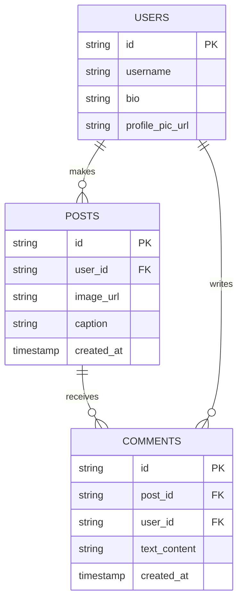
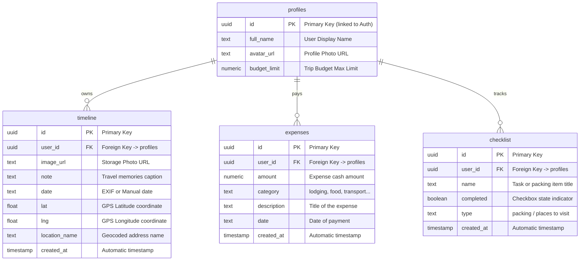

# מודול 7: עיצוב נתונים (Data Design) — משימת כיתה (אפליקציית MASA)

**האפליקציה שלי:** MASA (אתר דאשבורד אינטראקטיבי לניהול ותיעוד טיולים)

---

## 🔍 חלק 1: תרגיל חימום — ניתוח אפליקציה מוכרת

בחרנו לנתח את אפליקציית **Instagram** (אינסטגרם) כדי להבין את מבנה הנתונים שלה:

### ישויות (Entities) שזוהו במסך:
רשמנו את ה"דברים" המרכזיים שרואים במסך של אינסטגרם ושעל ניהולם מופקדת האפליקציה:

| שם הישות (Entity) | תיאור קצר | 3-4 תכונות עיקריות (Attributes) |
| :--- | :--- | :--- |
| **User** | פרופיל המשתמש באינסטגרם | `id` (PK), `username`, `bio`, `profile_pic_url` |
| **Post** | פוסט (תמונה או סרטון) שהעלה המשתמש | `id` (PK), `user_id` (FK), `image_url`, `caption`, `created_at` |
| **Comment** | תגובה שכתב משתמש כלשהו על פוסט | `id` (PK), `post_id` (FK), `user_id` (FK), `text_content`, `created_at` |

### קשרים (Relationships) בין הישויות:

| ישות A | סוג הקשר | ישות B | הסבר |
| :--- | :--- | :--- | :--- |
| **User** | One-to-Many | **Post** | משתמש אחד יכול לפרסם פוסטים רבים. |
| **Post** | One-to-Many | **Comment** | על פוסט אחד יכולות להיות תגובות רבות. |
| **User** | One-to-Many | **Comment** | משתמש אחד יכול לכתוב תגובות רבות. |

### שרטוט ERD מקוצר (Instagram):

---

## 🗺️ חלק 2: זיהוי ישויות בפרויקט MASA

עברנו על מסכי האתר הנוכחי של **MASA** ומיפינו את הישויות (Entities) שעומדות מאחוריהם:

### זיהוי הישויות לפי עמודי האפליקציה:

| שם העמוד | ישויות שזוהו | הערות |
| :--- | :--- | :--- |
| **Landing Page** (מסך כניסה) | `profiles` | מידע בסיסי על המשתמש וסטטוס התחברות (Google Auth / Local). |
| **Dashboard** (מסך מפה) | `profiles`, `timeline` | סיכות של חוויות טיולים הכוללות תמונות וקואורדינטות הממוקמות על גבי המפה. |
| **Assets List** (מסך תקציב) | `profiles`, `expenses` | ניהול יתרת התקציב ופירוט של הוצאות כספיות לפי קטגוריות. |
| **Goals Page** (יומן ורשימות) | `profiles`, `timeline`, `checklist` | כתיבה ביומן המסע וניהול רשימות הציוד והיעדים להכנת הטיול. |

---

### רשימת ישויות מוסכמת (ללא כפילויות):

| שם הישות (Entity) | באילו עמודים מופיעה | תיאור |
| :--- | :--- | :--- |
| **profiles** (משתמש) | כולם | מייצגת את הפרופיל של המטייל, תקציב הטיול הכללי שהגדיר והעדפות המפה שלו. |
| **timeline** (יומן מסע / חוויה) | מפה, יומן מסע | מייצגת נקודה גיאוגרפית שתועדה בטיול, המלווה בתאריך, תמונה וטקסט זיכרון. |
| **expenses** (הוצאה כספית) | מעקב תקציב | מייצגת הוצאה כספית בודדת שהוזנה לצורך בקרה על התקציב. |
| **checklist** (פריט רשימה) | רשימות תכנון | מייצגת פריט ציוד לאריזה או מקום לביקור שהמשתמש מתכנן להשלים. |

---

## ⚙️ חלק 3: הגדרת תכונות (Attributes)

להלן הגדרת העמודות וסוגי הנתונים לכל אחת מארבע הישויות המרכיבות את בסיס הנתונים של **MASA** (בסנכרון מול Supabase):

### ישות 1: `profiles` (פרופילי משתמשים)

| שם התכונה (Attribute) | סוג נתון | תיאור | מוצג ב-UI? |
| :--- | :--- | :--- | :--- |
| **id** | Text (UUID) | מזהה ייחודי של המשתמש (Primary Key) המקושר ל-Auth. | לא |
| **full_name** | Text | שם מלא של המשתמש (מתוך Google או ידני). | כן (בסרגל הניווט) |
| **avatar_url** | Text (URL) | קישור לתמונת האוואטר של המשתמש. | כן (בסרגל הניווט) |
| **budget_limit** | Number (Float) | הגבלת התקציב הכללית שהמשתמש הגדיר לטיול. | כן (במסך תקציב והגדרות) |

---

### ישות 2: `timeline` (חוויות ונקודות ציון בטיול)

| שם התכונה (Attribute) | סוג נתון | תיאור | מוצג ב-UI? |
| :--- | :--- | :--- | :--- |
| **id** | Text (UUID) | מזהה ייחודי של החוויה ביומן (Primary Key). | לא |
| **user_id** | Text (UUID) | מזהה המשתמש שיצר את החוויה (Foreign Key). | לא |
| **image_url** | Text (URL) | קישור לתמונה שהועלתה (Supabase Storage). | כן (בסיכת מפה וביומן) |
| **note** | Text | הערת טקסט וזיכרונות שכתב המשתמש על החוויה. | כן (ביומן ובבועת המפה) |
| **date** | Text (Date) | תאריך החוויה (נשלף מנתוני התמונה או הוזן). | כן (ביומן ובבועת המפה) |
| **lat** | Number (Float) | קו הרוחב הגיאוגרפי של התמונה לצורך סימון במפה. | כן (מיקום הסיכה) |
| **lng** | Number (Float) | קו האורך הגיאוגרפי של התמונה לצורך סימון במפה. | כן (מיקום הסיכה) |
| **location_name** | Text | שם המיקום הגיאוגרפי המפוענח (Nominatim API). | כן (ביומן ובמפה) |
| **created_at** | Date (Timestamp) | זמן הוספת הרשומה למערכת. | לא |

---

### ישות 3: `expenses` (הוצאות כספיות)

| שם התכונה (Attribute) | סוג נתון | תיאור | מוצג ב-UI? |
| :--- | :--- | :--- | :--- |
| **id** | Text (UUID) | מזהה ייחודי של ההוצאה (Primary Key). | לא |
| **user_id** | Text (UUID) | מזהה המשתמש שרשם את ההוצאה (Foreign Key). | לא |
| **amount** | Number (Float) | סכום ההוצאה הכספית (בשקלים). | כן (ברשימת ההוצאות וגרף) |
| **category** | Text | קטגוריית ההוצאה (לינה, אוכל, תחבורה, אטרקציות, קניות). | כן (בגרף פילוח ההוצאות) |
| **description** | Text | תיאור או כותרת ההוצאה (לדוגמה "כרטיס לרכבת מהירה"). | כן (ברשימה) |
| **date** | Text (Date) | תאריך ביצוע ההוצאה. | כן (ברשימה) |
| **created_at** | Date (Timestamp) | זמן הוספת הרשומה למערכת. | לא |

---

### ישות 4: `checklist` (רשימות הכנת הציוד והיעדים)

| שם התכונה (Attribute) | סוג נתון | תיאור | מוצג ב-UI? |
| :--- | :--- | :--- | :--- |
| **id** | Text (UUID) | מזהה ייחודי של פריט הרשימה (Primary Key). | לא |
| **user_id** | Text (UUID) | מזהה המשתמש שלו שייך הפריט (Foreign Key). | לא |
| **name** | Text | שם הפריט או משימת ההכנה (לדוגמה "לארוז דרכון"). | כן (ברשימה) |
| **completed** | Boolean | האם הפריט כבר בוצע/נארז (תיבת סימון). | כן (צ'קבוקס עגול) |
| **type** | Text | סוג הרשימה (packing - ציוד אריזה, places - מקומות לביקור). | כן (מפריד בין העמודות) |
| **created_at** | Date (Timestamp) | זמן הוספת הרשומה למערכת. | לא |

---

## 🗺️ חלק 4: מיפוי קשרים (Relationships)

הגדרנו את הקשרים הקימיים בין הישויות בבסיס הנתונים:

| ישות A | סוג הקשר | ישות B | הסבר |
| :--- | :--- | :--- | :--- |
| **profiles** | One-to-Many | **timeline** | משתמש אחד יכול לתעד הרבה חוויות טיול ביומן המסע שלו. |
| **profiles** | One-to-Many | **expenses** | משתמש אחד יכול לרשום הרבה הוצאות כספיות במהלך הטיול. |
| **profiles** | One-to-Many | **checklist** | משתמש אחד יכול לנהל הרבה משימות הכנה ורשימות ציוד. |

---

## 📊 חלק 5: מטריצת CRUD

פירוט הפעולות שמשתמש מחובר יכול לבצע על הנתונים שלו באתר MASA:

| שם הישות | Create — מה נוצר? | Read — מה מוצג? | Update — מה ניתן לערוך? | Delete — מה ניתן למחוק? |
| :--- | :--- | :--- | :--- | :--- |
| **profiles** | יצירת פרופיל חדש בעת התחברות ראשונית. | הצגת שם ותמונת פרופיל בסרגל העליון. | עדכון הגבלת התקציב או בחירת סגנון המפה. | מחיקת החשבון והגדרותיו מהמערכת. |
| **timeline** | העלאת תמונה ויצירת נקודה גיאוגרפית על המפה. | תצוגת סיכות מפה עם תמונות ופיד היומן הכרונולוגי. | עריכת תיאור החוויה או שינוי תאריך התיעוד. | מחיקת חוויה מהמפה ומיומן המסע. |
| **expenses** | הוספת הוצאה כספית חדשה עם סכום וקטגוריה. | הצגת הוצאות אחרונות ותרשים דונאט של הפילוח. | עריכת פרטי ההוצאה, הסכום או הקטגוריה. | מחיקת הוצאה לצורך עדכון ואיזון התקציב. |
| **checklist** | הוספת משימה או פריט ציוד חדש לעמודה המתאימה. | הצגת פריטי אריזה ויעדים עם מד אחוזי התקדמות. | סימון משימה כהושלמה (צ'קבוקס) או עריכת שמה. | מחיקת משימה מהרשימה. |

---

## 📐 חלק 6: דיאגרמת ERD (אתר MASA הנוכחי)

להלן תרשים קשרי ישויות (Entity-Relationship Diagram) מדויק המשקף את מבנה מסד הנתונים האמיתי של פרויקט **MASA** מול Supabase:

---

## 🔒 בונוס: הרשאות לפי תפקיד (Authorization Roles)

בבסיס הנתונים של MASA, מיושמת אבטחה ברמת השורה (RLS - Row Level Security) כדי להגן על פרטיות המשתמשים:

*   **User (מטייל רגיל):** יכול לבצע פעולות CRUD מלאות **אך ורק** על הנתונים ששייכים לו (לפי עמודת ה-`user_id` התואמת למזהה המשתמש המחובר).
*   **Owner (בעלי הפוסט/הנתון):** יש לו גישה מלאה לקריאה, כתיבה, עריכה ומחיקה של המידע האישי שלו.
*   **Admin (ניהול מערכת):** אין צורך בגישת מנהל מורחבת מאחר וכל משתמש מנהל מרחב נתונים מבודד ומאובטח לחלוטין.

| ישות | מי מורשה? | פעולה מותרת (CRUD) | הסבר אבטחה (RLS Rule) |
| :--- | :--- | :--- | :--- |
| **profiles** | Owner | Read, Update | משתמש רשאי לצפות בפרופיל שלו ולעדכן את ההגדרות שלו בלבד. |
| **timeline** | Owner | Create, Read, Update, Delete | מטייל יכול לנהל, לערוך ולמחוק רק את החוויות שהוא עצמו תיעד. |
| **expenses** | Owner | Create, Read, Update, Delete | מטייל יכול לנהל רק את ההוצאות והחשבונות שלו. |
| **checklist** | Owner | Create, Read, Update, Delete | מטייל יכול לסמן, להוסיף או למחוק משימות מהרשימות שלו בלבד. |
